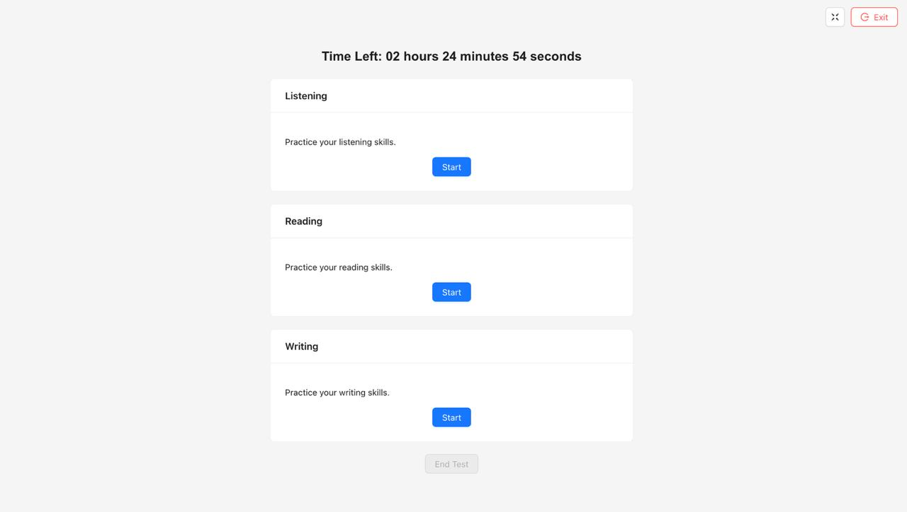
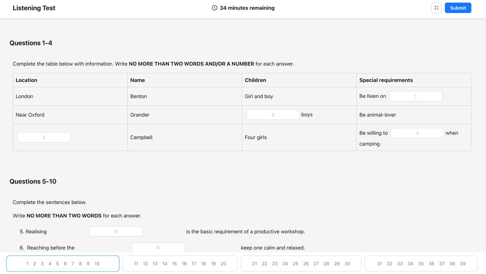
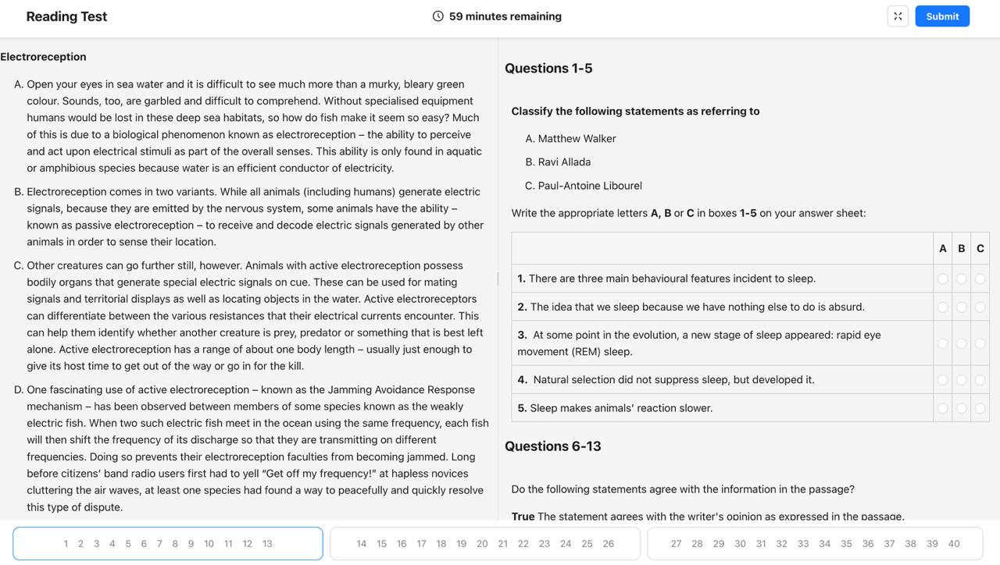
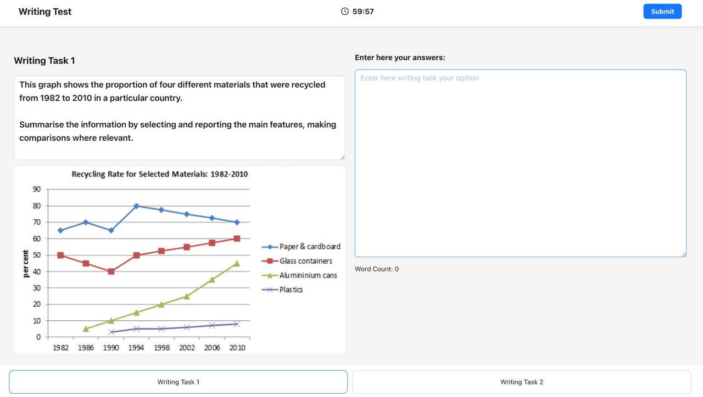

# IELTS Mock Exam Platform 🎓📝

A full-featured IELTS Mock Exam platform that simulates the real IELTS test experience for students. The platform offers **Listening**, **Reading**, and **Writing** tests — all administered in the same structure and format as the official IELTS exam.

## ✨ Features

- 🎧 **Listening Test**: Timed sections with audio playback and answer inputs.
  
- 📖 **Reading Test**: Interactive reading passages with various question types (e.g., multiple choice, matching headings, table completion).
  
- ✍️ **Writing Test**: Task 1 and Task 2 writing prompts with text editor and word count.
  
- ⏱️ **Real Exam Timings**: Mirrors official IELTS timing for each section.
- 📊 **Score Simulation**: Automatic scoring system for Listening and Reading; manual review for Writing.
- 📈 **Result Dashboard**: Users can view their scores, writing feedback, and test history.
- 👤 **User Authentication**: Register and log in to save test progress and view results.

## 🌟 Project Capabilities

- **Customizable Question Types**: Add new question types for Listening, Reading, and Writing sections.
- **Dynamic Content Management**: Easily update or modify test content via the admin panel.
- **Real-Time Feedback**: Provide instant feedback for Listening and Reading answers.
- **Scalable Architecture**: Designed to handle large numbers of concurrent users.
- **Secure Data Handling**: Implements JWT-based authentication and encrypted data storage.
- **Multi-Language Support**: Extendable to support multiple languages for global users.
- **Analytics Dashboard**: Track user performance and test statistics for improvement insights.